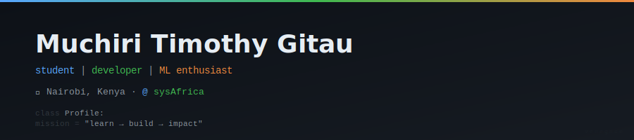

  

---

### 👋 Hi, I'm Muchiri Timothy Gitau

**Student @ The Co-operative University of Kenya** · Building **@ sysAfrica** · Nairobi, Kenya

I'm an aspiring developer exploring **Python**, **machine learning**, and backend systems. I love building tools that solve real problems — from memory-cache simulators to privacy-preserving ML models.

---

### 🛠️ What I Work With

  

- **Languages:** Python, TypeScript, JavaScript, HTML, CSS  
- **Exploring:** Machine Learning, Federated Learning, Django, Docker  
- **Tools:** Linux, Git, VS Code

---

### 📊 GitHub Stats

  
  

---

### 📌 Projects

- [**UpGridOracle**](https://github.com/gitau26timothy-CUK/UpGridOracle) — Privacy-preserving federated learning for electricity tariff redesign *(Python, ML)*  
- [**Altor-by-StateMachine**](https://github.com/MuchiriTimothyGitau/Altor-by-StateMachine) — Cross-platform memory-cache simulator powered by an FSM *(TypeScript)*  
- [**AquaVision**](https://github.com/MuchiriTimothyGitau/AquaVision) — Water system mirror — simple, understandable, memorable *(JavaScript)*  
- [**Smart-Wheelchair-Route-Mesh**](https://github.com/gitau26timothy-CUK/Smart-Wheelchair-Route-Mesh) — Accessible route planning system

---

### 📫 Connect

  
  
  

  
  

  <i>Student · Developer · ML Enthusiast</i> 
  <b>Always learning, always building.</b>

